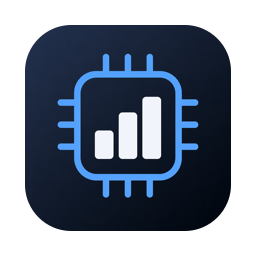
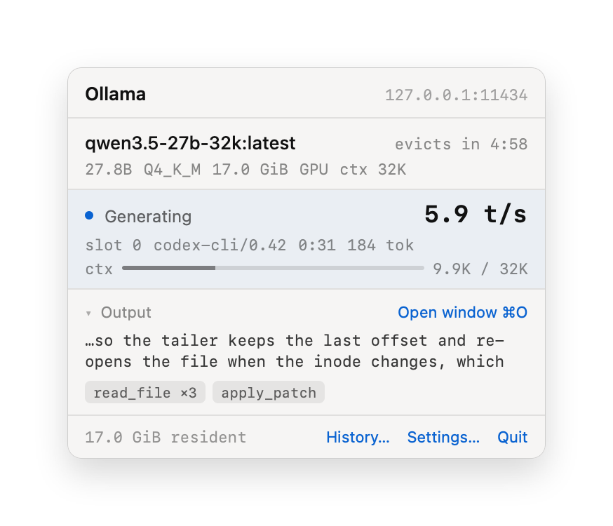
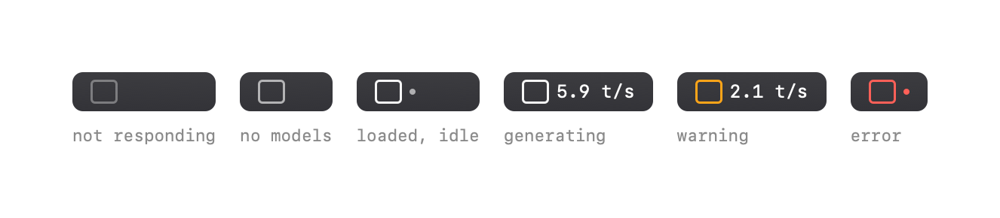
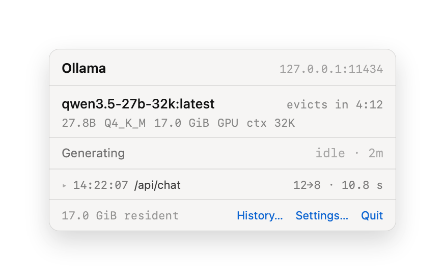
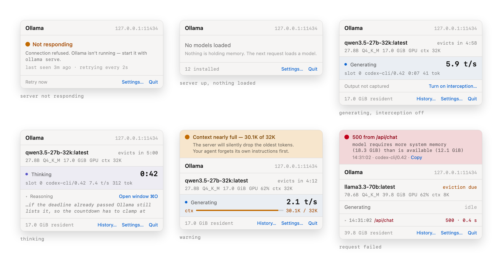
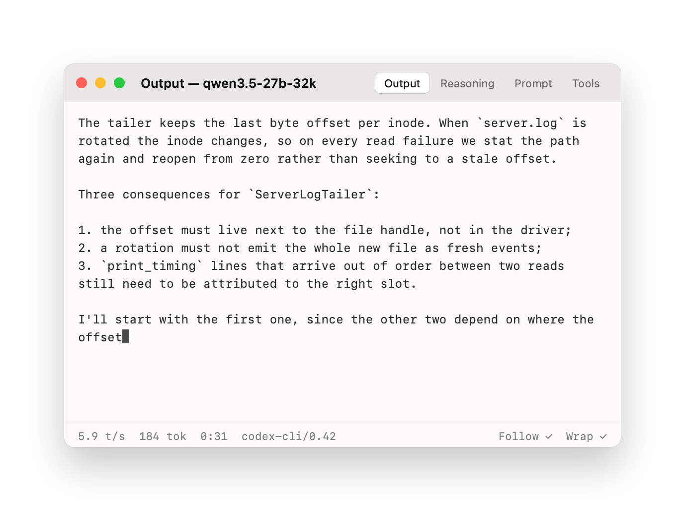
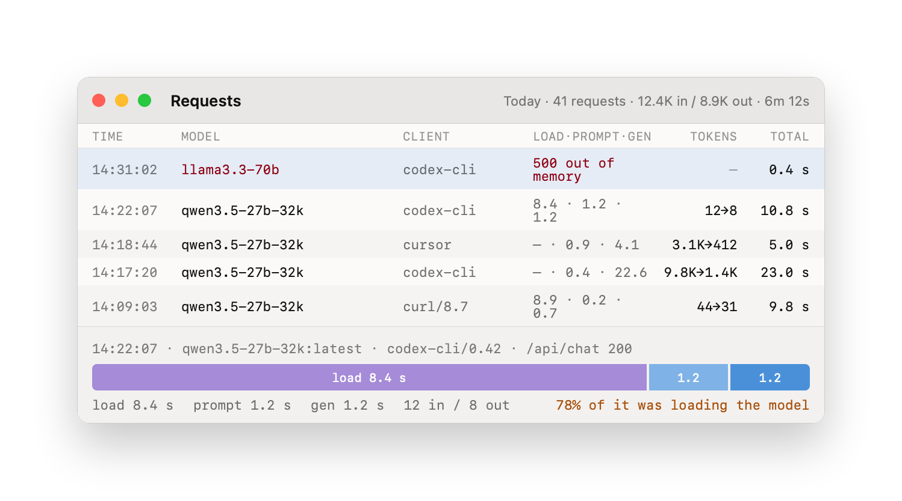
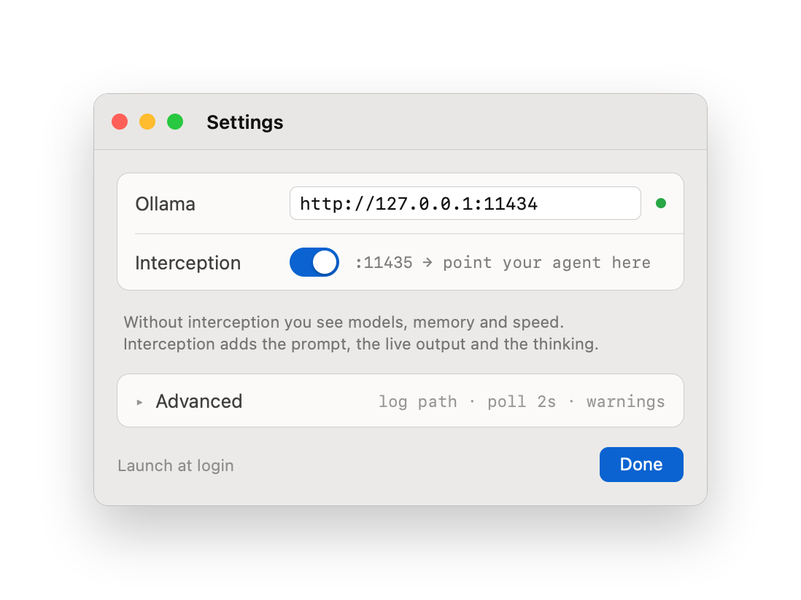

# ollama-bar

A macOS menu bar app that shows what your local Ollama server is actually doing — which models are loaded, what they cost in memory, how fast they are generating, and what they are producing right now.

Status: menu bar app, headless CLI, request interception and history on disk all work (M1–M3).



> The pictures below are rendered from the design mockup in [design/](design/), not screenshotted
> from a running app — several states, like a failed request or a context about to overflow, are
> not something you can stage on demand. [docs/DESIGN_BRIEF.md](docs/DESIGN_BRIEF.md) lists where
> the shipped app deliberately differs; the short version is that the background is the system
> material and the accents are the system's, not the mockup's hand-picked blue.

## Install

```bash
brew tap fosteev/ollama-bar https://github.com/fosteev/ollama-bar
brew trust --cask fosteev/ollama-bar/ollama-bar
brew install --cask ollama-bar
xattr -dr com.apple.quarantine /Applications/OllamaBar.app
```

The tap is this repository, so there is no second one to keep in sync. Homebrew 6 will not load a
cask from an unofficial tap until you say so, which is the `brew trust` line — a one-off that goes
away if this ever lands in homebrew/cask.

The last line is the ugly one, and it is not optional. The signature is ad-hoc because there is no
Developer ID to notarize with yet, so macOS refuses the app on first launch and offers exactly one
way forward: move it to the Trash. It is not a bluff — the app is gone, and the "Open Anyway"
button older instructions send you to is not offered for this case. Clearing the flag Homebrew set
on the download is what is left. You will need it again after every upgrade, until there is a
notarized build — see [docs/TODO.md](docs/TODO.md).

If that trade is not one you want to make, build it yourself instead: a local build is never
quarantined, because it was never downloaded.

Or build it yourself:

```bash
brew install tuist
./scripts/build-release.sh   # builds Release and copies it into /Applications
open -a OllamaBar
```

From Xcode instead: `tuist generate`, open `OllamaBar.xcworkspace`, Cmd+R.

## In the menu bar



There is no Dock icon, and the label stays quiet: an icon, a dot once a model is resident, and a
number only while something is generating. Warnings and errors arrive as colour rather than text —
they read from the corner of your eye and cost no width. The icon goes back to normal as soon as
you open the panel, because by then the warning has been delivered. The rate is monospaced and
always six characters, so the items next to it never shift.

## The panel

With a model loaded and nothing running, that is three blocks and a footer:



Nothing holds space for later. Each block is there because its data is there and disappears with
it — no placeholder rows with dashes. `Generating / idle` is the exception and stays put: gone
entirely, it would leave you wondering whether the app is watching at all. Everything else the
panel can show:



## Seeing output

Ollama offers no way to watch another client's stream, and its log carries metadata only. To see
what a model is actually producing, turn on interception (Settings, or `--proxy` on the CLI) and
point your client at that port instead of Ollama's.



The proxy is a byte-for-byte TCP relay: it never parses or re-encodes what it forwards. HTTP is
reconstructed from a copy of the stream purely for display, so a bug there costs you visibility and
nothing else. Transparency is checked by tests that compare a proxied response against the same
request made directly.

## Where the time went



Every request is recorded — time, model, client, tokens in and out, and the split between loading the
model, reading the prompt and generating. The split is usually the answer to "why was that slow":
a first request against a cold model spends most of its time loading it.

## Settings



On the surface, only what you actually change: the address and interception. The log path, the poll
interval, warning thresholds, retention and the theme all live under Advanced with working
defaults. There is no Apply button — settings take effect when the field loses focus.

## The CLI

Same core, no Xcode required:

```bash
swift run ollama-bar-cli                # live view, refreshes every 2s
swift run ollama-bar-cli --once         # one snapshot
swift run ollama-bar-cli --proxy 11435  # and watch what passes through
swift run ollama-bar-cli --proxy 11435 --record   # ...and write it to the app's history
```

```
ollama-bar  http://127.0.0.1:11434

qwen3.5-27b-32k:latest
  27.8B Q4_K_M  17.0 GiB  GPU  ctx 32K  evicts in 4:12

total resident: 17.0 GiB
generating: 5.9 t/s (slot 0)
```

Needs a local Ollama; nothing has to be reconfigured on the client side.

## Development

```bash
swift test
```

`Sources/Core` holds the domain and the monitor, `Sources/Infrastructure` the HTTP client, the
`server.log` tailer and storage, `Sources/App` the SwiftUI menu bar app, `Sources/CLI` the terminal
front end. Parsers are tested against samples recorded from a live server in `Fixtures/`.

Settings live in `~/.ollamabar/settings.json`, history in `~/.ollamabar/history` — one JSONL index
per day, with the prompt and output texts as separate files under `bodies/`. History older than a
week is deleted automatically; the window is configurable under Settings → Advanced. Both are plain
files you can read, edit or delete by hand.

The logic builds as a plain SPM package, so `swift test` runs without generating an Xcode project;
Tuist exists only for the `.app` bundle. Both read the same source directories.
`scripts/make-icon.swift` cuts the icon set from `design/icon.png`, applying the rounded square
macOS expects the artwork to carry; `scripts/render-design.swift` re-renders the images on this page
from the mockup.

Releases go out by tag. `scripts/release.sh 0.2.0` moves the version in `Project.swift` — the one
place it lives — commits, tags and pushes; [the workflow](.github/workflows/release.yml) refuses a
tag that disagrees with the project, then tests, builds, publishes the archive and points
[the cask](Casks/ollama-bar.rb) at it.

See [docs/PLAN.md](docs/PLAN.md) for the architecture and roadmap, and
[docs/TODO.md](docs/TODO.md) for what is still missing.

MIT — see [LICENSE](LICENSE).
